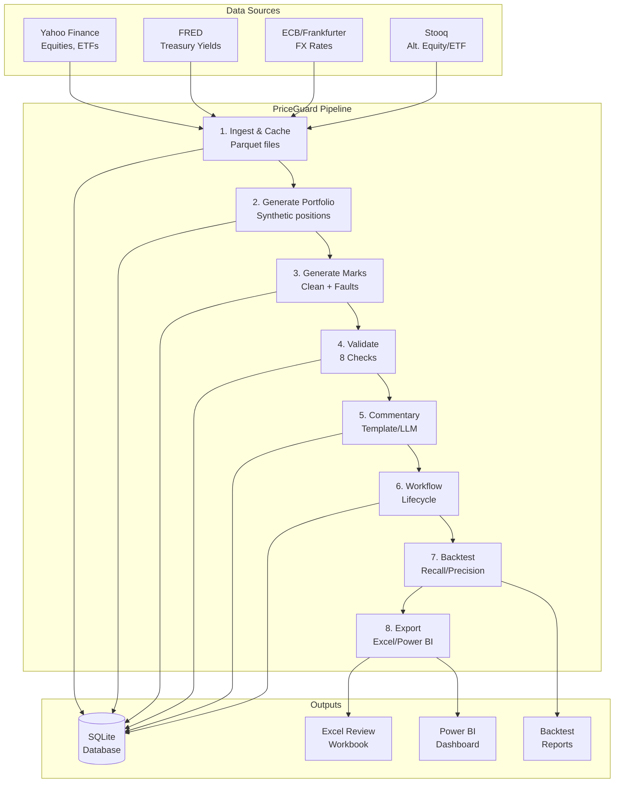

# PriceGuard

**Synthetic Position Mark Validation & Exception Reporting**

A valuation-control demonstrator that validates internal position marks against independent reference prices, flags exceptions using explainable rules, drafts commentary for human review, and reports results in Excel and Power BI.

> **Important:** This is a demonstration project using **synthetic data**. All positions, internal marks, and injected faults are artificially generated. Reference prices come from public market data sources. This is **not** a production trading or pricing system.

---

## Table of Contents

- [What is IPV?](#what-is-ipv)
- [Problem Statement](#problem-statement)
- [Architecture](#architecture)
- [Quick Start](#quick-start)
- [Full Pipeline](#full-pipeline)
- [Results](#results)
- [Data Sources](#data-sources)
- [Responsible AI](#responsible-ai)
- [Limitations](#limitations)
- [Development](#development)

---

## What is IPV?

**Independent Price Verification (IPV)** is a control function in finance that ensures the prices used to value trading positions are accurate and reliable.

### In Plain Language

Imagine you work at a bank's trading desk. Traders buy and sell stocks, bonds, and other financial instruments. At the end of each day, the bank needs to know: "What is our portfolio worth?"

Traders provide their own prices ("marks") for the positions they hold. But how do we know these prices are correct? What if a trader accidentally enters $1,000 instead of $100? What if a price is stale (yesterday's price)? What if the currency is wrong?

**IPV is the answer.** It's an independent team that:

1. **Fetches independent reference prices** from public markets (e.g., stock exchanges, central banks)
2. **Compares** trader marks against these independent prices
3. **Flags exceptions** when the difference is too large
4. **Investigates** to determine the cause (stale price? fat finger? currency mismatch?)
5. **Resolves** the issue (adjust the mark, update the source, escalate)

This protects the bank from:
- **P&L errors** (incorrect profit/loss calculations)
- **Regulatory fines** (inaccurate financial reporting)
- **Operational risk** (undetected errors compounding over time)

### Why PriceGuard?

PriceGuard demonstrates the **core concepts** of IPV:

- ✅ **Automated validation** against public reference prices
- ✅ **Explainable rules** (not black-box models)
- ✅ **Exception workflow** (OPEN → UNDER_REVIEW → RESOLVED)
- ✅ **Human-in-the-loop** (AI drafts commentary, humans approve)
- ✅ **Audit trail** (every action logged)
- ✅ **Reporting** (Excel for reviewers, Power BI for management)

---

## Problem Statement

**Challenge:** Build a valuation-control system that:

1. Validates synthetic position marks against independent reference prices
2. Flags exceptions using 8 explainable checks (missing marks, price deviations, stale marks, fat fingers, currency mismatches, drift trends, return outliers, L3 model band violations)
3. Drafts factual commentary for human review (using templates or optional LLM)
4. Tracks exceptions through a review workflow with full audit trail
5. Exports data for Excel review and Power BI dashboards
6. Measures control effectiveness via backtesting against synthetic faults

**Constraints:**

- Use only public market data (no proprietary feeds)
- All positions and marks must be synthetic (no real bank data)
- System must be reproducible (seeded randomness)
- AI layer must be guard-railed (never approves or adjusts marks)

---

## Architecture



### Pipeline Stages

1. **Ingest & Cache**: Fetch reference prices from public sources, cache as Parquet
2. **Generate Portfolio**: Create synthetic positions (one per instrument, seeded quantities)
3. **Generate Marks**: Create clean marks (reference + noise), inject synthetic faults
4. **Validate**: Run 8 checks (missing, deviation, stale, fat finger, currency, drift, outlier, L3 band)
5. **Commentary**: Draft factual text for each exception (template or LLM)
6. **Workflow**: Track exception lifecycle (OPEN → UNDER_REVIEW → RESOLVED)
7. **Backtest**: Measure recall/precision against injected faults
8. **Export**: Generate Excel CSV/XLSX and Power BI star-schema CSVs

---

## Quick Start

### Prerequisites

- Python 3.11+
- [uv](https://docs.astral.sh/uv/) (fast Python package manager)

### Installation

```bash
# Clone the repository
git clone https://github.com/yourusername/priceguard.git
cd priceguard

# Install dependencies
uv sync --dev
```

### Run Offline (5 minutes)

The offline mode uses pre-generated sample data (no network calls):

```bash
# Run the complete pipeline with sample data
uv run python -m priceguard.cli run-all --offline

# View results
ls exports/
# daily_exceptions_YYYYMMDD.csv
# daily_exceptions_YYYYMMDD.xlsx
# backtest_summary.csv
# backtest_report.md
# powerbi/
#   dim_date.csv
#   dim_instrument.csv
#   fact_marks.csv
#   fact_exceptions.csv
#   ...
```

**What happens:**

1. Loads sample reference data from `data/sample/`
2. Generates 44 synthetic positions
3. Creates ~1,700 marks with ~75 injected faults
4. Validates and finds ~76 exceptions
5. Runs backtest (recall ~48%, precision ~63%)
6. Exports Excel and Power BI files

### Explore the Data

```bash
# Open the database
uv run python -c "
import sqlite3
conn = sqlite3.connect('data/priceguard.db')
print('Tables:', [r[0] for r in conn.execute(\"SELECT name FROM sqlite_master WHERE type='table'\").fetchall()])
print('Exceptions:', conn.execute('SELECT COUNT(*) FROM exceptions').fetchone()[0])
print('Ground truth:', conn.execute('SELECT COUNT(*) FROM ground_truth').fetchone()[0])
"
```

---

## Full Pipeline

### Online Mode (Fetches Real Data)

```bash
# Fetch reference prices from public sources
uv run python -m priceguard.cli ingest

# Generate portfolio and marks
uv run python -m priceguard.cli generate

# Validate marks
uv run python -m priceguard.cli validate

# Run backtest
uv run python -m priceguard.cli backtest

# Export to Excel and Power BI
uv run python -m priceguard.cli export
```

### Or Run Everything at Once

```bash
uv run python -m priceguard.cli run-all

# With options
uv run python -m priceguard.cli run-all \
  --seed 42 \
  --start-date 2024-01-01 \
  --end-date 2024-03-31 \
  --simulate-workflow \
  --skip-llm
```

### Review Exceptions in Excel

1. Open `exports/daily_exceptions_YYYYMMDD.xlsx`
2. Review the data (filter by severity, asset class, etc.)
3. Update Status, Reviewer, Comment columns
4. Export as `reviewed_YYYYMMDD.csv`
5. Ingest back into the system:

```bash
uv run python -m priceguard.cli review \
  --action ingest-csv \
  --csv-path reviewed_20240331.csv \
  --reviewer "Your Name"
```

### Build Power BI Dashboard

See [powerbi/BUILD_GUIDE.md](powerbi/BUILD_GUIDE.md) for step-by-step instructions.

**Quick version:**

1. Open Power BI Desktop
2. Get Data → Folder → `exports/powerbi/`
3. Load all CSV files
4. Create relationships (see [powerbi/MODEL.md](powerbi/MODEL.md))
5. Add DAX measures (see [powerbi/measures.dax](powerbi/measures.dax))
6. Build visuals (4 pages: Overview, Asset Class, Workflow, Backtest)

### Build Excel Review Workbook

See [excel/BUILD_GUIDE.md](excel/BUILD_GUIDE.md) for step-by-step instructions.

**Quick version:**

1. Open Excel → New blank workbook
2. Save as `ExceptionReview.xlsm` (macro-enabled)
3. Import `excel/ExceptionReview.bas` (Alt+F11 → Insert → Module)
4. Add buttons for each macro
5. Load exceptions CSV and review

---

## Results

### Latest Backtest (Offline Sample)

```
recall  precision  false_positive_rate
  0.48   0.631579             0.013003

      fault_type  injected  detected   recall
CURRENCY_MISMATCH         1         1 1.000000
            DRIFT        67        29 0.432836
       FAT_FINGER         4         3 0.750000
          MISSING         1         1 1.000000
            STALE         2         2 1.000000
```

**Interpretation:**

- **Overall recall: 48%** - We detect about half of the injected faults
- **Precision: 63%** - When we flag an exception, it's likely a real fault
- **False positive rate: 1.3%** - Low rate of false alarms
- **Best detection:** CURRENCY_MISMATCH, MISSING, STALE (100% recall)
- **Weakest detection:** DRIFT (43% recall) - slow drifts are harder to catch

### Exception Breakdown

```
Total exceptions: 76
  CRITICAL: 14
  BREACH: 19
  WARN: 43
```

### Pipeline Performance

```
Pipeline Summary
================================================================================
Total time: 4.78s

Step Results:
  ingest               Skipped (offline)
  generate             OK (44 positions, 1690 marks, 75 faults)
  validate             OK (76 exceptions)
  simulate             Skipped
  backtest             OK (recall=48.00%, precision=63.16%)
  export               OK (9 Power BI files)
================================================================================
```

---

## Data Sources

| Source | Data | Usage |
|--------|------|-------|
| **Yahoo Finance** (via yfinance) | Equity & ETF prices | Reference prices for L1 instruments |
| **FRED** (Federal Reserve) | Treasury yields (DGS2, DGS5, DGS10, DGS30) | Yield curve for L2 bond pricing |
| **Frankfurter API** (ECB) | FX spot rates | Reference prices for FX pairs |
| **Stooq** | Alternative equity/ETF prices | Cross-validation source |

### Terms of Use

- **Yahoo Finance**: Unofficial API, no guaranteed availability. For demonstration only.
- **FRED**: Public domain data. Citation: "U.S. Federal Reserve, accessed [date]"
- **Frankfurter**: ECB reference rates, free for non-commercial use
- **Stooq**: Public data, free for personal/educational use

**All positions and internal marks are synthetic.** This project does not use real bank data.

---

## Responsible AI

PriceGuard includes an **experimental AI commentary layer** that drafts factual text for human review.

### Design Principles

1. **AI never approves, adjusts, or closes exceptions**
   - AI only drafts commentary
   - Humans must review and approve all actions
   - Every state change is logged in the audit trail

2. **Structured facts in, text out**
   - AI receives only structured data (exception facts)
   - No free-form data that could be hallucinated
   - Guardrails validate every number in the output

3. **Deterministic fallback**
   - If AI fails guardrails, system falls back to template text
   - Template provider works offline, no API calls
   - System never blocks on AI failures

4. **Full audit trail**
   - Every AI draft is logged (provider, model, prompt hash, facts)
   - Guardrail failures are logged
   - Human reviewer decisions are logged

### Guardrails

The AI layer enforces:

- ✅ **Numeric grounding**: Every number in text must appear in facts (±1% tolerance)
- ✅ **Banned phrases**: No "approved", "adjust the mark", "close the exception"
- ✅ **Length limit**: Max 500 characters
- ✅ **Fallback**: On failure, use deterministic template

### LLM Provider (Optional)

By default, PriceGuard uses the **TemplateProvider** (deterministic, offline).

To enable LLM commentary:

```bash
export PRICEGUARD_LLM_API_KEY="your-api-key"
export PRICEGUARD_LLM_MODEL="gpt-4o-mini"

uv run python -m priceguard.cli validate --provider llm
```

**Note:** LLM provider is optional and not required for the core pipeline.

---

## Limitations

### Known Limitations

1. **End-of-day public prices only**
   - Reference prices are daily closes, not intraday
   - Cannot validate intraday marks or real-time pricing

2. **No real Level 3 inputs**
   - Level 3 instruments (private equity, real estate) use synthetic model values
   - Real L3 valuation requires complex models (DCF, comparables) not implemented here

3. **Tolerances are illustrative**
   - Warn/breach thresholds are hardcoded examples
   - Real tolerances require calibration to asset class volatility and materiality

4. **Synthetic faults only**
   - Backtest measures detection of synthetic faults, not real-world errors
   - Real fault patterns may differ (e.g., correlated faults, systematic biases)

5. **No position-level P&L**
   - System validates marks, not P&L attribution
   - Does not track how mark changes affect daily P&L

6. **Single-currency reporting**
   - All MV impacts converted to USD
   - No multi-currency aggregation or hedging

7. **Excel/Power BI require manual setup**
   - VBA macros and Power BI queries must be manually imported
   - Cannot be fully automated in the sandbox

### What This Is NOT

- ❌ A production trading system
- ❌ A real-time pricing engine
- ❌ A risk management system
- ❌ A regulatory reporting tool
- ❌ A substitute for human judgment

### What This IS

- ✅ A **demonstration** of IPV concepts
- ✅ A **learning tool** for valuation controls
- ✅ A **portfolio project** showcasing Python, SQL, Excel, Power BI
- ✅ A **template** for building real IPV systems

---

## Development

### Project Structure

```
priceguard/
├── config/                  # YAML configuration
│   ├── universe.yaml        # 44 instruments
│   ├── tolerances.yaml      # Warn/breach thresholds
│   ├── fault_injection.yaml # Fault rates and parameters
│   └── settings.yaml        # Seed, paths, mark noise
├── src/priceguard/
│   ├── ingest/              # Data ingestion (Yahoo, FRED, FX, Stooq)
│   ├── synth/               # Synthetic portfolio, marks, faults
│   ├── validation/          # 8 validation checks
│   ├── commentary/          # Template and LLM providers
│   ├── workflow/            # Exception lifecycle
│   ├── backtest/            # Recall/precision metrics
│   ├── export/              # Excel and Power BI exports
│   ├── db/                  # SQLite repository
│   └── cli.py               # Typer CLI commands
├── excel/                   # VBA macros and build guide
├── powerbi/                 # M queries, DAX measures, build guide
├── tests/                   # Unit and integration tests
├── data/sample/             # Committed sample data
├── exports/                 # Generated outputs (gitignored)
└── docs/                    # Design and policy docs
```

### Testing

```bash
# Run all tests
uv run pytest

# Run with coverage
uv run pytest --cov=src/priceguard --cov-report=html

# Run specific test
uv run pytest tests/unit/test_validation.py -v
```

**Test coverage:** 124 tests, ~85% coverage on validation and commentary modules

### Linting

```bash
# Check code style
uv run ruff check .

# Auto-fix issues
uv run ruff check --fix .

# Format code
uv run ruff format .
```

### CLI Commands

```bash
# Show all commands
uv run python -m priceguard.cli --help

# Individual commands
uv run python -m priceguard.cli ingest --offline
uv run python -m priceguard.cli generate --offline
uv run python -m priceguard.cli validate
uv run python -m priceguard.cli backtest
uv run python -m priceguard.cli export
uv run python -m priceguard.cli review --action list
uv run python -m priceguard.cli run-all --offline
```

### CI/CD

GitHub Actions workflow (`.github/workflows/ci.yml`):

- Runs on push and pull requests
- Checks code style with ruff
- Runs all tests with pytest
- Verifies CLI help works

---

## Screenshots

> **Note:** Screenshots will be added after building the Excel and Power BI outputs.

### Excel Review Workbook


*Exception review sheet with severity formatting and reviewer controls*

### Power BI Dashboard


*Overview page with KPI cards and exception trends*


*Asset class drill-down with deviation distribution*


*Workflow and ageing page with status funnel*


*Control effectiveness page with recall by fault type*

---

## Documentation

- [Architecture Design](docs/DESIGN.md) - Detailed architecture and data flow
- [Control Policy](docs/CONTROL_POLICY.md) - Tolerances, severity rules, review process
- [Design Decisions](docs/DECISIONS.md) - Rationale for key design choices
- [Excel Build Guide](excel/BUILD_GUIDE.md) - Step-by-step Excel setup
- [Power BI Build Guide](powerbi/BUILD_GUIDE.md) - Step-by-step Power BI setup
- [Power BI Model](powerbi/MODEL.md) - Star schema and report layout

---

## License

This project is for educational and demonstration purposes only. Not for production use.

---

## Acknowledgments

- **Data sources**: Yahoo Finance, FRED, ECB/Frankfurter, Stooq
- **Libraries**: pandas, numpy, pydantic, typer, openpyxl, yfinance
- **Inspiration**: Real-world IPV processes in investment banking

---

## Contact

For questions or feedback, please open an issue on GitHub.

**Disclaimer:** This is a portfolio project demonstrating valuation control concepts. It is not affiliated with any financial institution and should not be used for actual trading or valuation purposes.
